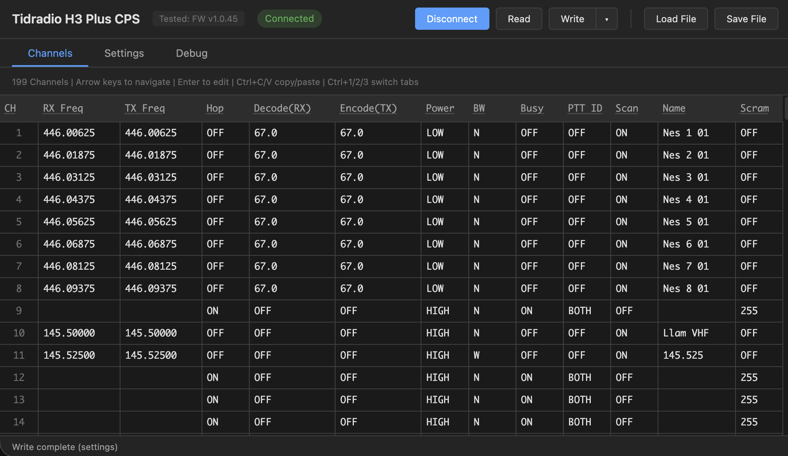
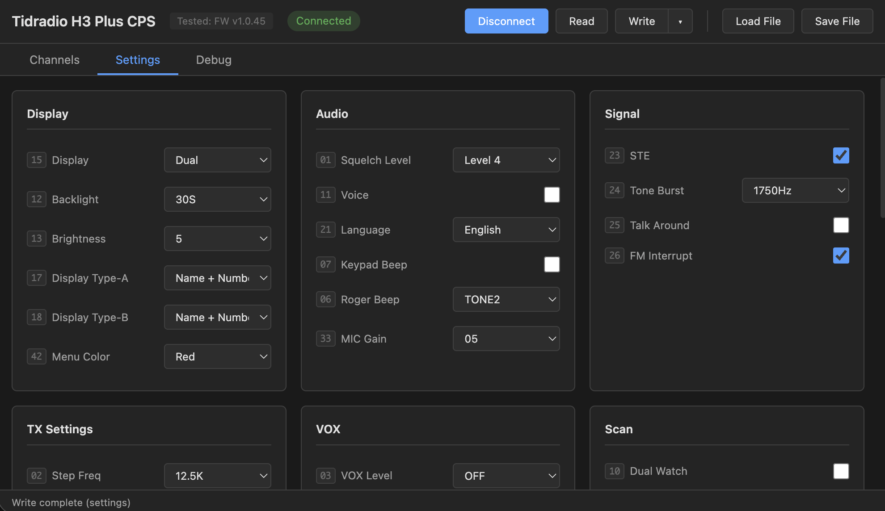
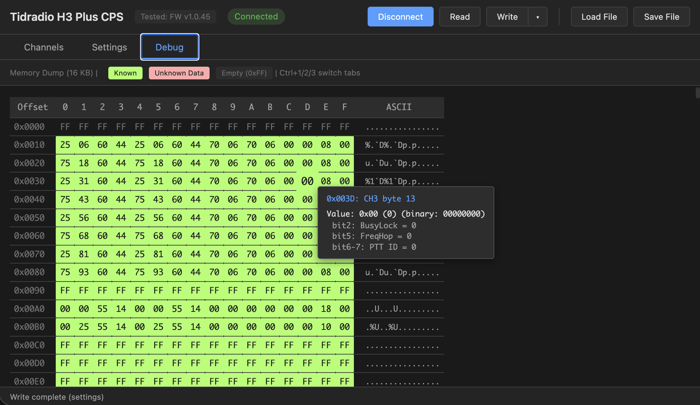

# Tidradio H3 Plus Web CPS

Web-based Bluetooth Low Energy (BLE) Customer Programming Software (CPS) for the Tidradio H3 Plus radio.

**[Launch App](https://jamarju.github.io/tid-h3-plus-cps/)**

## Quick Start

1. Enable Bluetooth on your H3 Plus (Menu > Settings > Bluetooth > ON)
2. Open the app in Chrome or Edge
3. Click **Connect** and select your radio
4. Click **Read** to download configuration
5. Edit channels/settings
6. Click **Write** to upload changes

## Screenshots

### Channels


### Settings


### Debug


## File Format

Configurations are saved as `.h3p` files - raw 16KB binary dumps of radio memory. This preserves all data including unknown fields for future compatibility.

## Development

```bash
python -m http.server 8000
# Open http://localhost:8000
```

See [docs/](docs/) for memory maps and protocol documentation.

## License

MIT
